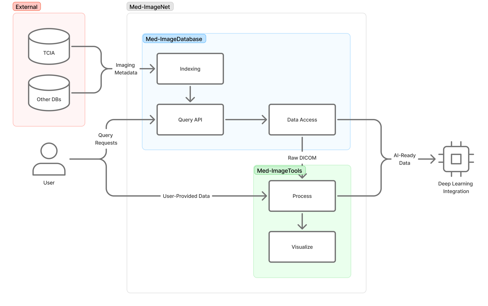

# Med-ImageNet: Open-source Medical Imaging Data Curation for Large-scale AI

Med-ImageNet is a framework for accessing and curating standardized
oncology imaging data for AI-driven cancer research. It provides:

- **Querying** indexed medical imaging datasets across multiple collections
- **Downloading** selected DICOM and NIfTI series from TCIA, S3, Dropbox, and Zenodo
- **Standardization** via [med-imagetools](https://github.com/bhklab/med-imagetools)

Med-ImageNet makes medical imaging data **FAIR (Findable, Accessible,
Interoperable, and Reusable)** for machine learning applications,
prioritizing data inclusivity by representing diverse populations
in cancer research.

## Installing med-imagenet

```console
pip install med-imagenet
imgnet --help
```

## Usage

```console
# List available collections
imgnet collections
```

```console
# Query datasets and download them
imgnet query -c 4D-Lung -m CT -r '{"CT": "BodyPartExamined == LUNG"}' | imgnet download
```


## Architecture




