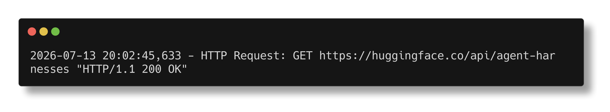
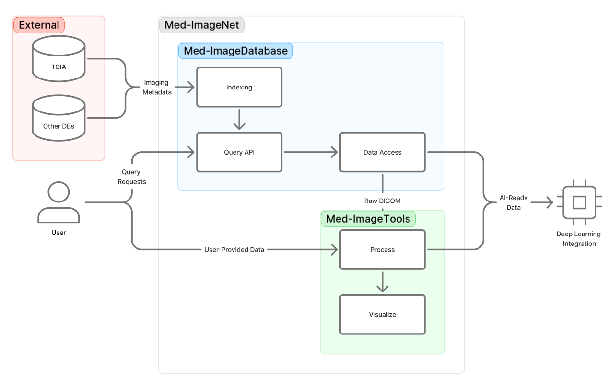

# Med-ImageNet: A Standardized Resource for AI-Ready Oncology Imaging

## Core Features

Med-ImageNet is an open-source platform that transforms heterogeneous
cancer imaging collections into harmonized, AI-ready resources for
oncology research. It provides tools to **query**, **download**, and
**preprocess** medical imaging datasets from public and user-provided
sources through a unified Python interface.



## Platform Components

The platform comprises three integrated components:

1. **Med-ImageDB** -- Dataset indexing, query API, and secure image and
   metadata retrieval across all supported collections. The index can be found
   [here](https://huggingface.co/datasets/bhklab2026/med-image-index).

2. **Med-ImageTools** --
   Standardized preprocessing including DICOM ingestion, voxel harmonization,
   intensity normalization, and metadata alignment. The tools can be found [here](https://github.com/bhklab/med-imagetools).

3. **Med-ImageNet Repository** -- Unifies these modules into a scalable and
   reproducible data compendium supporting both raw data access and AI-ready
   outputs (e.g., NIfTI format) for deep learning integration.



## Installing Med-ImageNet

```console
pip install med-imagenet
```

```console
imgnet --help
```

## Key Capabilities

- Queries across **all supported collections** with associated metadata
- Establishes explicit links between **paired imaging modalities**
  (e.g., CT with RTSTRUCTs)
- Query and request datasets based on **imaging region** and **imaging modality**
- Downloads from TCIA/IDC, S3, Dropbox, Zenodo, and HuggingFace sources
- Processes raw DICOM files to generate **AI-ready NIfTI outputs**,
  tabular metadata files, and dataset summaries

## License

This project uses the following license: [MIT License](https://github.com/bhklab/med-imagenet/blob/main/LICENSE)
