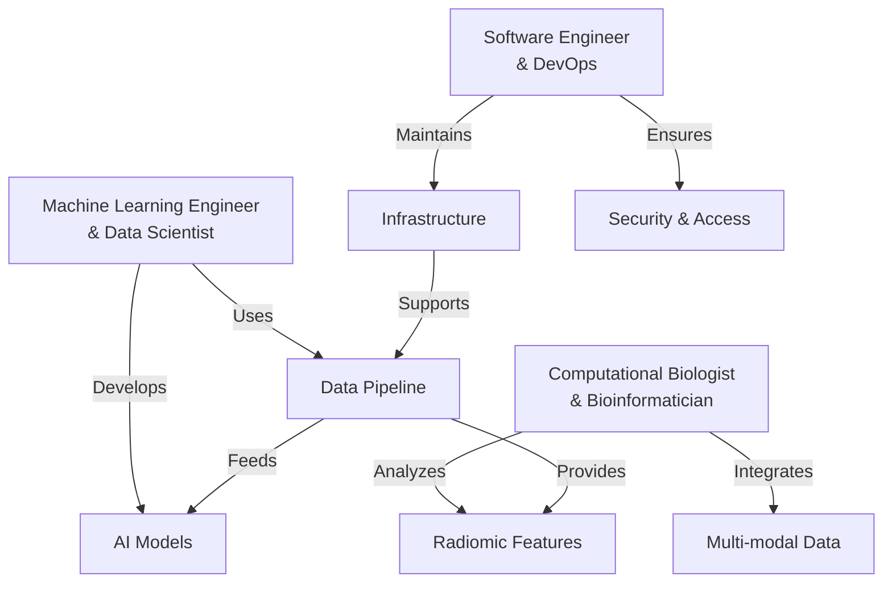
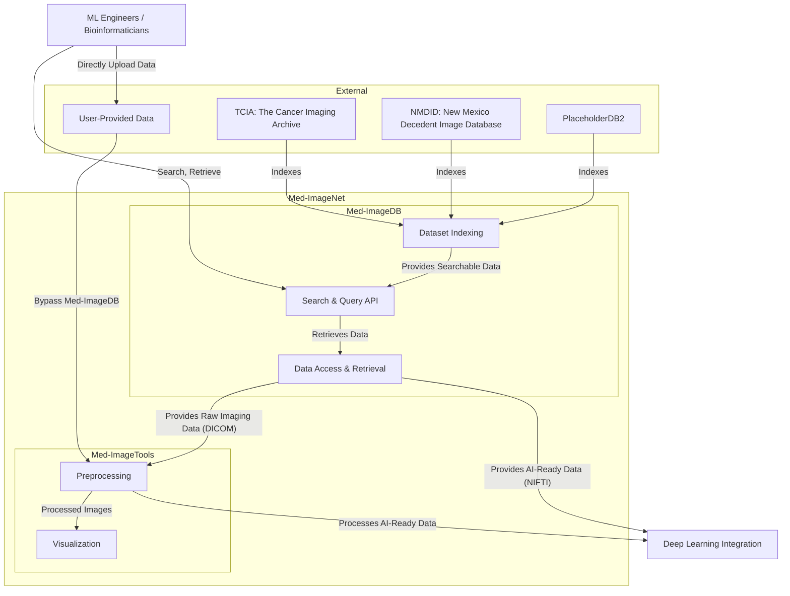

# User Stories

## Context

Med-ImageNet is a framework for accessing, retrieving, and preprocessing
medical imaging datasets from public and user-provided sources. 
It bridges raw imaging data and downstream AI/ML workflows with
standardized tools for querying, loading, and visualizing medical images.

## User Pain Points

Medical imaging researchers and data scientists face a variety of challenges when 
working with large-scale datasets and building reproducible pipelines. The following 
pain points illustrate the key barriers that Med-ImageNet aims to address:

- **Fragmented Access to Public Datasets:** Public repositories like TCIA are rich 
  resources, but their interfaces can be inconsistent, poorly documented, or 
  difficult to access programmatically. This slows down research and introduces 
  manual steps in data acquisition workflows.

- **Limited Metadata Querying Capabilities:** Finding relevant datasets based on 
  imaging modality, disease type, or annotation availability is often difficult. 
  Users typically need to manually inspect metadata or download large index files 
  to perform even basic filtering tasks.

- **Inconsistent Data Formats and Standards:** Imaging data is often stored in
  DICOM format, which is *supposed* to be a standard but can vary in practice.
  There are many tools online that make strict assumptions and are not always
  robust with the massive variation in dicom data.
  Moreover, researchers spend a significant amount of time converting data to
  a common format (NIfTI, HDF5) for machine learning workflows.

- **Lack of Reusable Preprocessing Pipelines:** There is no common framework to 
  perform tasks such as intensity normalization, resampling, or segmentation. 
  Researchers often implement these steps manually, leading to duplicated effort 
  and difficulty in reproducing results.

- **Poor Visualization Tooling for Medical Images:** Many researchers lack tools to 
  interactively explore 2D/3D medical images with overlays of masks or annotations. 
  Visualization is often limited to static plots or external viewers with steep 
  learning curves.

- **Scattered Tooling Ecosystem:** Tools for downloading, preprocessing, visualizing, 
  and analyzing medical imaging data are scattered across different languages, 
  formats, and libraries. This leads to brittle pipelines and high onboarding time 
  for new users.

Med-ImageNet aims to eliminate these bottlenecks by providing a consistent, unified 
Python interface for querying datasets, preprocessing images, and preparing data for 
machine learning workflows.

## User Groups

These groups represent the primary users of Med-ImageNet and their respective needs.
For the most part, these groups are not mutually exclusive and may overlap in practice.

For example, since a primary feature of Med-ImageNet is to provide access to
medical imaging datasets for downstream work, both ML Engineers and Bioinformaticians
will follow a similar workflow of data access and preprocessing before diverging
into their respective tasks of model training and feature analysis.

#### Machine Learning Engineers & Data Scientists (ML/DS)
- Develop and optimize deep learning models for medical imaging
- Create and validate AI models for diagnosis and prognosis
- Need efficient data loading and preprocessing pipelines
- Require standardized evaluation metrics and benchmarks

#### Computational Biologists & Bioinformaticians (CB/B)
- Analyze radiomic features and multi-modal medical datasets
- Integrate imaging data with genomic and clinical information
- Perform statistical analysis and hypothesis testing
- Extract quantitative features from medical images

#### Software Engineers & DevOps (SWE/DevOps) [Stretch Goal]
- Deploy and maintain Med-ImageNet in clinical or research environments
- Ensure system reliability and performance
- Implement security and access control measures
- Manage data storage and retrieval infrastructure

## User Needs

As a (ML/DS, CB/B), I would want to be able to

- know what access I have to publicly available datasets
    - Browse available datasets with clear documentation
    - Understand dataset characteristics and limitations
    - Access dataset statistics and quality metrics
- know how I can access and download these datasets
    - Simple authentication and authorization process
    - Clear documentation on data usage rights
    - Efficient download mechanisms for large datasets
- query publicly available datasets for specific data
    - Search by modality, disease, patient characteristics
    - Filter by image quality and annotation availability
    - Access metadata programmatically

As a (ML/DS, CB/B), I want a set of tools that can help me

- preprocess and clean medical imaging data
    - converting to `SimpleITK.Image` objects 
    - indexing and querying metadata
- visualize and explore medical imaging data
    - 2D/3D visualization
    - interactive exploration

As a (ML/DS, CB/B), I want a single Python API that can

- load and access (potentially large) medical imaging datasets
- provide a consistent interface for data access and preprocessing
- integrate with popular deep learning frameworks (e.g. PyTorch, TensorFlow)

## User Personas Flow

## Architecture

The architecture of Med-ImageNet is designed to provide seamless access to
public medical imaging datasets, while also allowing users to bring their
own data for analysis and processing. The system consists of
three major components:

### Components

1. Public Medical Imaging Databases
    - These databases host publicly available medical imaging datasets,
    including radiological images (CT, MRI, PET) and associated metadata
    such as patient demographics, pathology reports, and annotations
    - **Example:** TCIA (The Cancer Imaging Archive) provides a
    repository of de-identified medical images for research
    - Additionally, some databases may have `Annotation` data that can be
    used for training and validation of AI models such as
    `DICOM-SEG` or `DICOM-RTSTRUCT`

2. Med-ImageDB (Data Indexing & Access Layer)
    - A Python package that acts as an intermediary between users and multiple public databases
    - Indexes datasets from sources like TCIA, making them searchable and accessible through a standardized API
    - Supports metadata queries to filter datasets by modality, annotation availability, ROI Name, etc.
    - Handles (maybe) authentication, and efficient downloading of large datasets

3. Med-ImageTools (Processing & Preprocessing Layer)
    - A Python package that enables seamless data processing for both indexed datasets from Med-ImageDB and user-provided imaging data
    - Supports format conversion (e.g., SimpleITK.Image, numpy.ndarray)
    - Implements preprocessing functions such as intensity normalization, resampling, and segmentation
    - Provides visualization tools for 2D and 3D exploration of medical images
    - Integrates with deep learning frameworks (e.g., PyTorch, TensorFlow) for model training and inference

### User Data Flow & Interaction

There are two main pathways for users:

1. Public Dataset Access & Processing
    - Users query Med-ImageDB to find relevant datasets from public sources
    - The system retrieves dataset metadata from sources like TCIA
    - Users download datasets through Med-ImageDB
    - The raw imaging data is passed to Med-ImageTools for preprocessing and analysis

2. User-Provided Data Processing
    - Users can bring their own imaging data directly into Med-ImageTools, bypassing Med-ImageDB
    - The same preprocessing and analysis tools are available for both public and 
      user-provided datasets, they will have to process themselves.
    - This allows for flexibility in research workflows, integrating proprietary or experimental datasets

### Architecture Diagram

## Technical Scope
Defining granular technical requirements for each componenet

1. Med-ImageDB
    - Input: TCIA API / List of public datasets
    - Output: Med-ImageNet index

2. Med-ImageTools
    - Input: Raw Imaging Data / DICOM (CT, MR, PET, RTDOSE, RTSTRUCT, SEG)
    - Output: AI-Ready Data / NIfTI, HDF5

## Glossary

---

**AI-Ready**  
Imaging data that has been preprocessed to meet the input requirements of
machine learning pipelines.

  - This typically includes format conversion (e.g.,
    DICOM to NIfTI) and possibly some transformations. 
  - Importantly, there will should be some metadata to accompany the data
    that adds context to the data, including fields from the DICOM file,
    computed information (size, shape, etc.), possible references to
    other series or studies, and any annotations that may be available.

---

**Annotation**  
Supplementary data associated with medical images that describe structures,
regions of interest (ROIs), or diagnoses. Examples include segmentations
(DICOM-SEG), radiotherapy structures (DICOM-RTSTRUCT), or bounding boxes.

---

**DICOM (Digital Imaging and Communications in Medicine)**  
A standard format for storing and transmitting medical images and metadata.
DICOM files are often used in clinical imaging and contain detailed metadata
about the patient, acquisition parameters, and study information.

---

**DICOM-SEG**  
A standardized DICOM object for storing segmentation masks. Each mask encodes
a region of interest (e.g., tumor) as a labelmap aligned to the original image.

---

**DICOM-RTSTRUCT**  
A type of DICOM object used in radiotherapy to define contours of anatomical
structures. These are often used for planning radiation therapy and may contain
multiple labeled ROIs.

---

**Indexing**  
The process of collecting and organizing metadata about imaging datasets to
enable fast search, filtering, and access. Med-ImageDB performs indexing from
public sources like TCIA.

---

**Metadata**  
Information about an image or dataset, such as patient age, modality, scan date,
disease site, and annotation availability. Metadata is critical for filtering,
querying, and dataset selection.

---

**Modality**  
The imaging technique used to acquire the data, such as CT (Computed Tomography),
MRI (Magnetic Resonance Imaging), or PET (Positron Emission Tomography).

---

**NIfTI (Neuroimaging Informatics Technology Initiative)**  
A common file format (.nii or .nii.gz) used for storing medical imaging data
in research, particularly in neuroimaging and machine learning applications.

---

**Preprocessing**  
The set of operations applied to raw imaging data to prepare it for analysis or
modeling. This may include resampling, normalization, cropping, masking, or
alignment to a reference space.

---

**Radiomics**  
The extraction of quantitative features from medical images, often used to
describe shape, texture, and intensity patterns. Radiomics enables non-invasive
characterization of tumors and other structures.

---

**Region of Interest (ROI)**  
A specific area within an image that is annotated for analysis, such as a tumor,
organ, or anatomical region. ROIs are usually defined using masks or contours.

---

**Resampling**  
The process of changing the spatial resolution or voxel spacing of an image to
ensure consistency across samples. This is important for aligning data from
different scanners or modalities.

---

**SimpleITK**  
A simplified interface to the Insight Segmentation and Registration Toolkit
(ITK), used for reading, writing, and processing medical images in Python.

---

**TCIA (The Cancer Imaging Archive)**  
A publicly accessible repository of de-identified medical images organized into
collections, often with accompanying clinical and genomic data. Med-ImageNet
uses TCIA as a primary public data source.

---

**Visualization**  
Tools or processes used to explore and inspect medical images in 2D or 3D.
Visualization may include overlaying masks, plotting slices, or interactive
navigation across image volumes.
