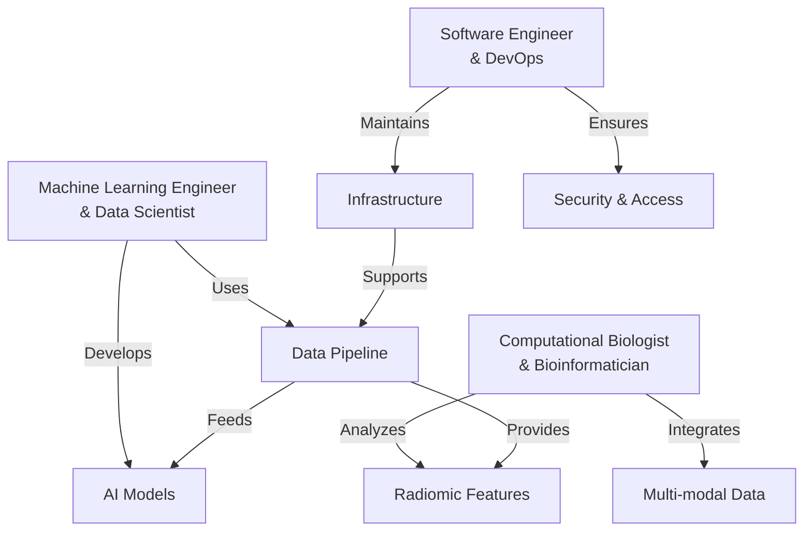
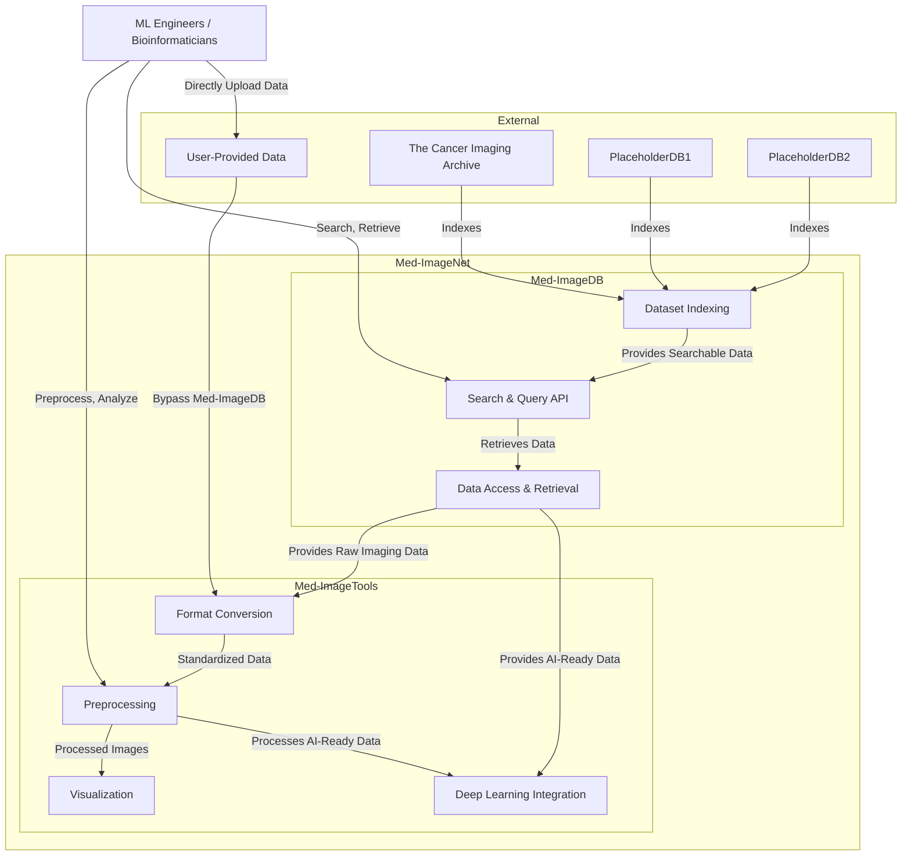

# User Stories

## User Groups

These groups represent the primary users of Med-ImageNet and their respective needs.
For the most part, these groups are not mutually exclusive and may overlap in practice.

For example, since a primary feature of Med-ImageNet is to provide access to
medical imaging datasets for downstream work, both ML Engineers and Bioinformaticians
will follow a similar workflow of data access and preprocessing before diverging
into their respective tasks of model training and feature analysis.

### Machine Learning Engineers & Data Scientists (ML/DS)
- Develop and optimize deep learning models for medical imaging
- Easily create and validate AI models for diagnosis and prognosis
- Have AI-ready imaging data for rapid model prototyping
- Need efficient data loading and preprocessing pipelines
- Require standardized evaluation metrics and benchmarks

### Computational Biologists & Bioinformaticians (CB/B)
- Analyze radiomic features and multi-modal medical datasets
- Integrate imaging data with genomic and clinical information
- Perform statistical analysis and hypothesis testing
- Extract quantitative features from medical images

### Software Engineers & DevOps (SWE/DevOps) [Stretch Goal]
- Deploy and maintain Med-ImageNet in clinical or research environments
- Ensure system reliability and performance
- Implement security and access control measures
- Manage data storage and retrieval infrastructure

## User Needs

As a (ML/DS, CB/B), I would want to be able to
- know what access I have to publicly available datasets
  - Browse available datasets with clear documentation
  - Understand dataset characteristics and limitations
  - Access dataset statistics and quality metrics
- know how I can access and download these datasets
  - Simple authentication and authorization process
  - Clear documentation on data usage rights
  - Efficient download mechanisms for large datasets
- query publicly available datasets for specific data
  - Search by modality, disease, patient characteristics
  - Filter by image quality and annotation availability
  - Access metadata programmatically

As a (ML/DS, CB/B), I want a set of tools that can help me
- download AI-ready datasets (only TCIA? should check DUAs)
  - Access NIfTI/HDF5 images of public DICOM datasets
  - Consistent metadata/clinical fields
  - As similar to the raw data as possible, without too much manipulation
- preprocess and clean medical imaging data
  - Converting to `SimpleITK.Image` objects 
  - Indexing and querying metadata
- visualize and explore medical imaging data
  - 2D/3D visualization
  - Interactive exploration

As a (ML/DS, CB/B, SWE/DevOps), I want a single Python API that can
- Load and access (potentially large) medical imaging datasets
- Provide a consistent interface for data access and preprocessing
- Integrate with popular deep learning frameworks (e.g. PyTorch, TensorFlow)

## User Personas Flow

# Architecture

The architecture of Med-ImageNet is designed to provide seamless access to public medical imaging datasets, while also allowing users to bring their own data for analysis and processing. The system consists of three major components:

## 1. Public Medical Imaging Databases
- Examples: TCIA, PlaceholderDB1, PlaceholderDB2
- These databases host publicly available medical imaging datasets, including radiological images (CT, MRI, PET) and associated metadata such as patient demographics, pathology reports, and annotations
- **Example:** TCIA (The Cancer Imaging Archive) provides a repository of de-identified medical images for research
- Additionally, some databases may have `Annotation` data that can be used for training and validation of AI models such as `DICOM-SEG` or `DICOM-RTSTRUCT`

## 2. Med-ImageDB (Data Indexing & Access Layer)
- A Python package that acts as an intermediary between users and multiple public databases
- Indexes datasets from sources like TCIA, making them searchable and accessible through a standardized API
- Supports metadata queries to filter datasets by modality, annotation availability, ROI Name, etc.
- Handles (maybe) authentication, and efficient downloading of large datasets

## 3. Med-ImageTools (Processing & Preprocessing Layer)
- A Python package that enables seamless data processing for both indexed datasets from Med-ImageDB and user-provided imaging data
- Supports format conversion (e.g., SimpleITK.Image, numpy.ndarray)
- Implements preprocessing functions such as intensity normalization, resampling, and segmentation
- Provides visualization tools for 2D and 3D exploration of medical images
- Integrates with deep learning frameworks (e.g., PyTorch, TensorFlow) for model training and inference

## User Data Flow & Interaction

There are two main pathways for users:

### 1. Public Dataset Access & Processing
- Users query Med-ImageDB to find relevant datasets from public sources
- The system retrieves dataset metadata from sources like TCIA
- Users download datasets through Med-ImageDB
- The raw imaging data is passed to Med-ImageTools for preprocessing and analysis

### 2. User-Provided Data Processing
- Users can bring their own imaging data directly into Med-ImageTools, bypassing Med-ImageDB
- The same preprocessing and analysis tools are available for both public and private datasets
- This allows for flexibility in research workflows, integrating proprietary or experimental datasets

## Architecture Diagram

## Technical Scope
Defining granular technical requirements for each componenet

### 1. Med-ImageDB
- Input: TCIA API / List of public datasets
- Output: Med-ImageNet index

### 2. Med-ImageTools
- Input: Raw Imaging Data / DICOM (CT, MR, PET, RTDOSE, RTSTRUCT, SEG)
- Output: AI-Ready Data / NIfTI, HDF5
